# Package Interaction Diagrams

## System Architecture Overview

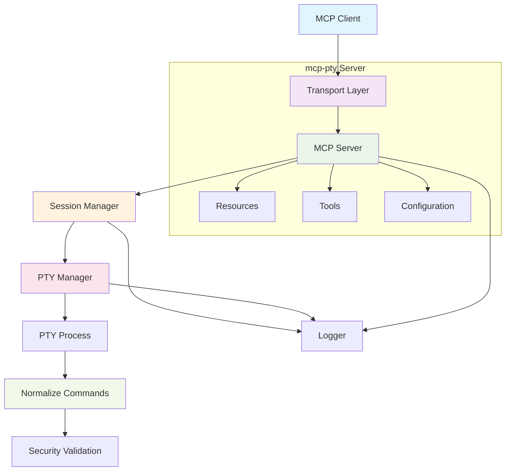

## Request Flow Diagram

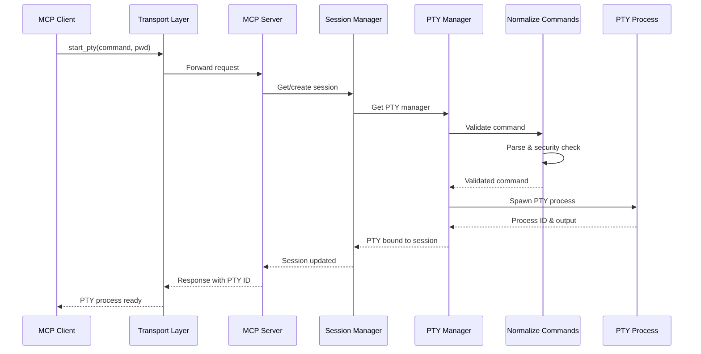

## Session Lifecycle Diagram

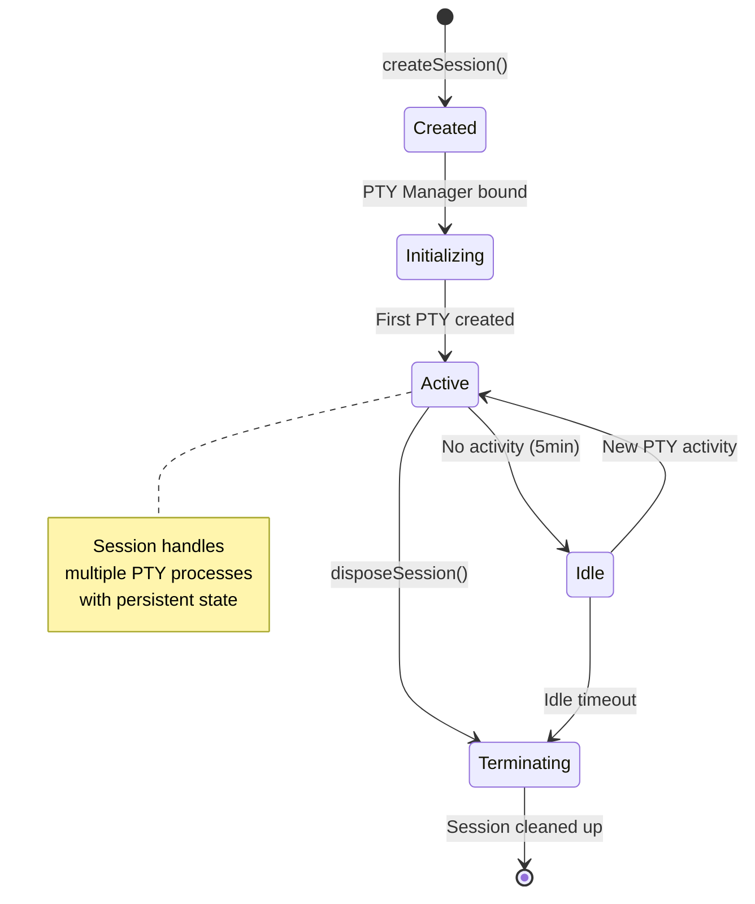

## PTY Process Lifecycle Diagram

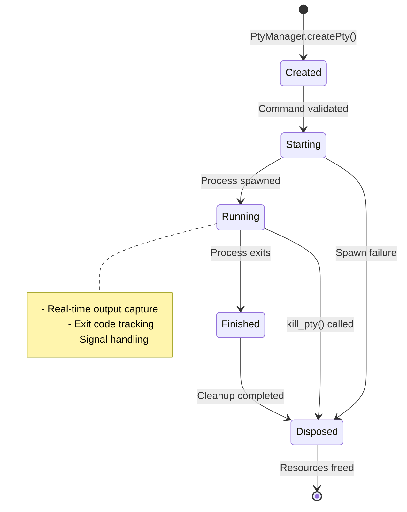

## Package Dependencies Diagram

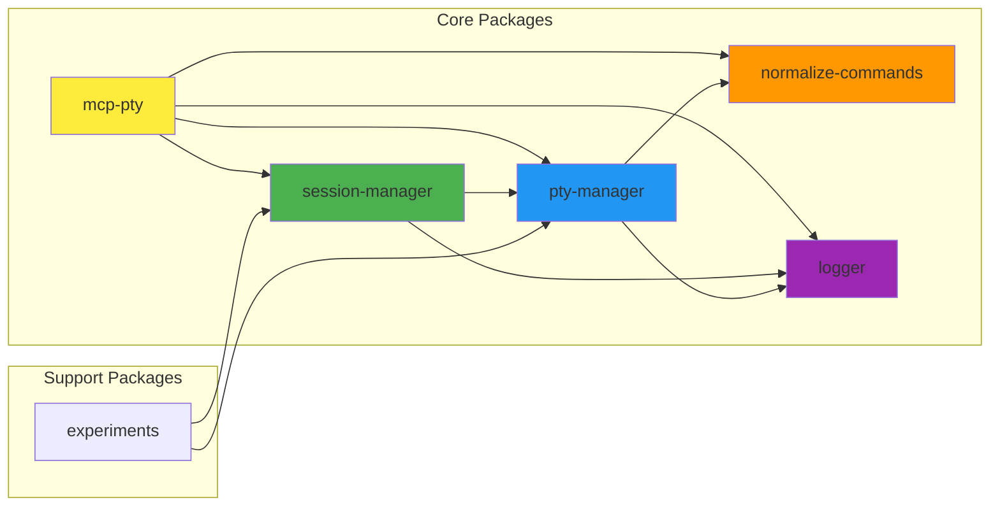

## Transport Layer Architecture

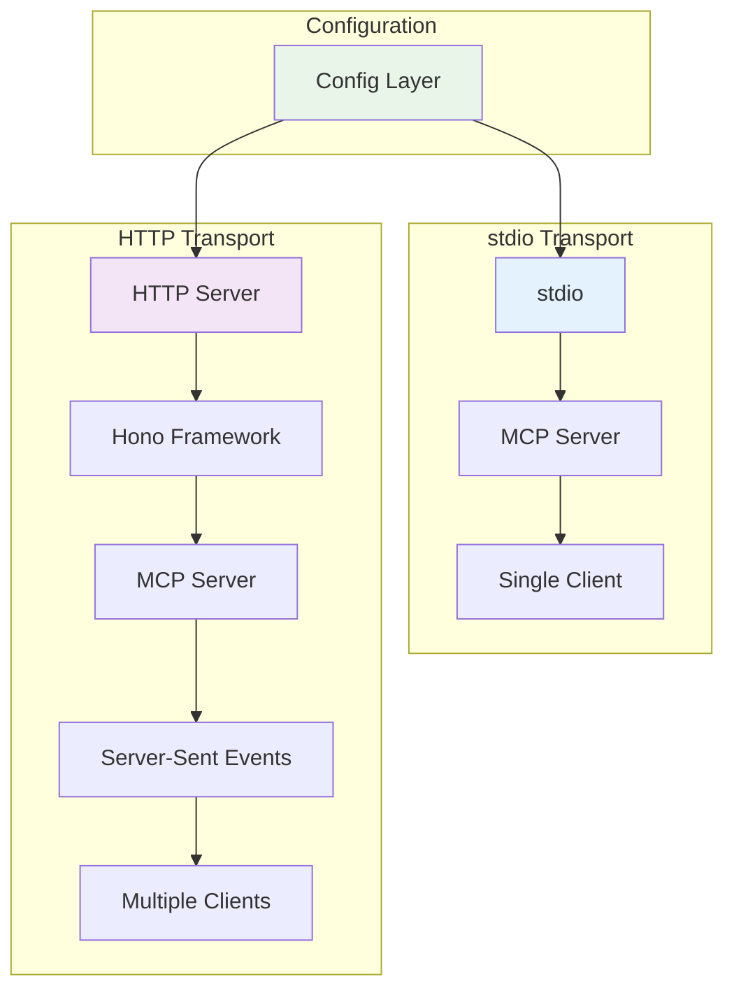

## Security Validation Flow

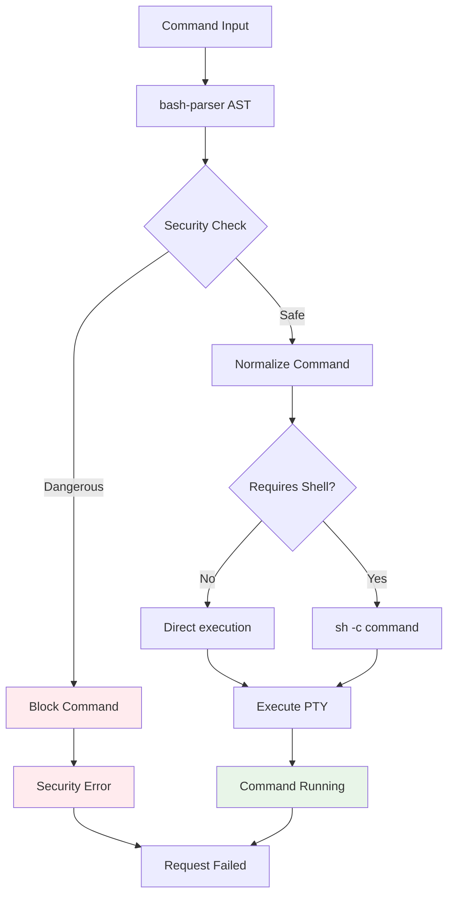

## Resource Management Diagram

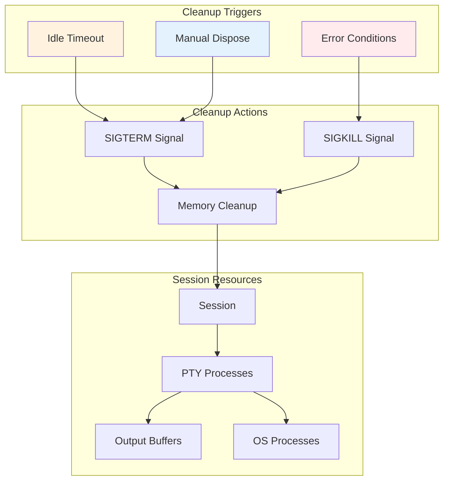

## Configuration System Diagram

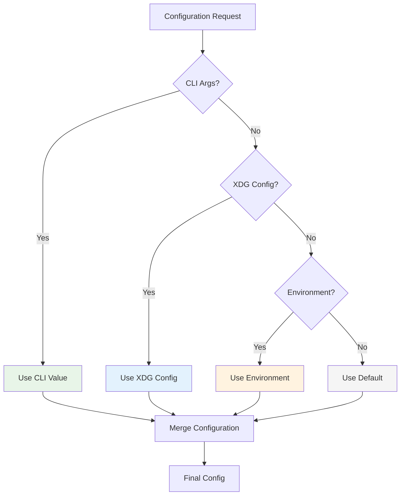

## Error Handling Flow

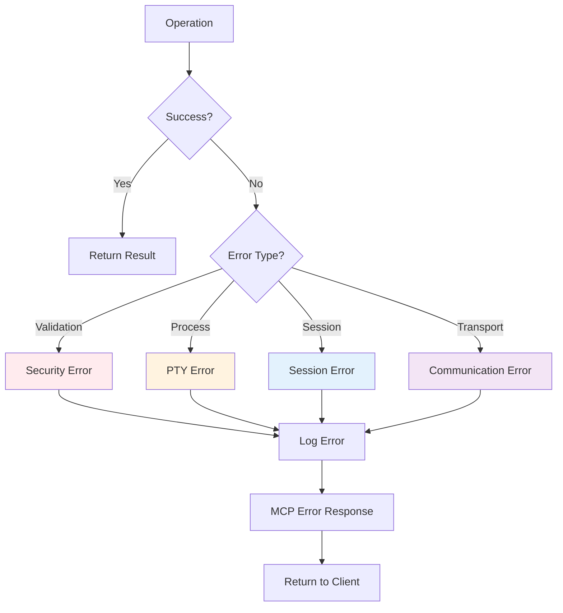

## Testing Architecture Diagram

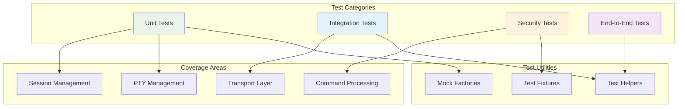