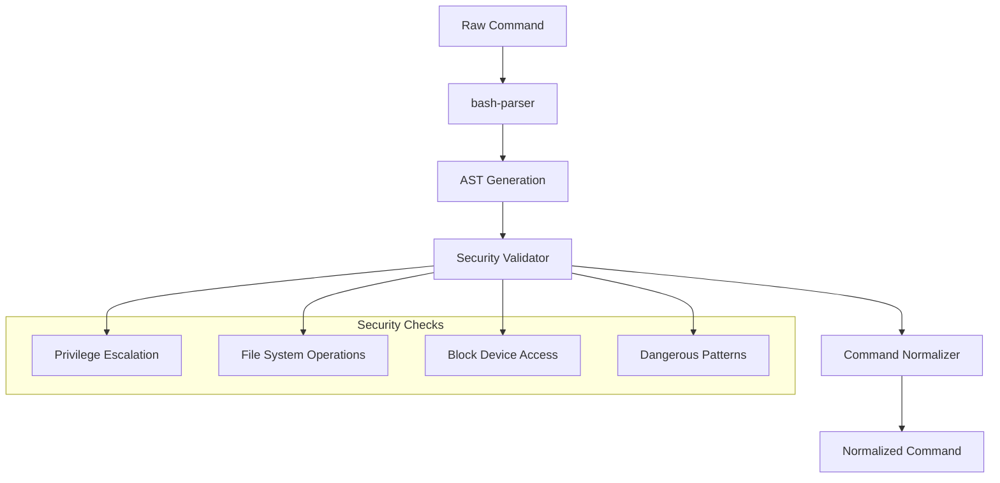

# Normalize Commands Integration

This document provides a comprehensive guide to the `normalize-commands` package integration within the mcp-pty ecosystem.

## Overview

The `normalize-commands` package is a critical security and parsing component that processes all user commands before execution in PTY sessions. It provides:

- **Bash syntax parsing** using AST analysis
- **Security validation** against dangerous commands
- **Command normalization** for optimal execution
- **Shell requirement detection** for complex operations

## Architecture

### Core Components



### Integration Points

1. **PTY Manager**: Primary consumer for command validation
2. **MCP Server**: Entry point for user commands
3. **Session Manager**: Indirect consumer via PTY operations

## API Reference

### Main Function

```typescript
/**
 * Normalizes a command string into a JSON string representing the command and arguments.
 * @param input - The command string to normalize
 * @returns JSON string with {command: string, args: string[]}
 * @throws {Error} if dangerous command detected
 */
export const normalizeCommand = (input: string): string;
```

### Output Format

```json
{
  "command": "sh",
  "args": ["-c", "echo hello && ls -la"]
}
```

Or for simple commands:

```json
{
  "command": "ls",
  "args": ["-la", "/home"]
}
```

## Security Validation

### Dangerous Command Categories

#### 1. Privilege Escalation

Blocks commands that can escalate privileges:
- `sudo`
- `su`
- `doas`
- `pkexec`

```typescript
// Blocked
normalizeCommand("sudo rm -rf /") // Throws Error
```

#### 2. Filesystem Dangers

Blocks destructive filesystem operations:
- `rm -rf /` (recursive root deletion)
- `mkfs.*` (filesystem formatting)
- `chmod 777` (insecure permissions)

```typescript
// Blocked
normalizeCommand("rm -rf /") // Throws Error
normalizeCommand("mkfs.ext4 /dev/sda1") // Throws Error
normalizeCommand("chmod 777 /etc/passwd") // Throws Error
```

#### 3. Block Device Operations

Blocks writes to block devices:
- `dd` with block device output
- Redirects to `/dev/sd*`

```typescript
// Blocked
normalizeCommand("dd if=/dev/zero of=/dev/sda1") // Throws Error
normalizeCommand("echo data > /dev/sda1") // Throws Error
```

### Bypass Mechanism

Dangerous commands can be bypassed with environment variable:

```bash
export MCP_PTY_USER_CONSENT_FOR_DANGEROUS_ACTIONS=true
```

**Warning**: Use with caution in development environments only.

## Command Processing Flow

### Step 1: Input Validation

```typescript
const trimmed = input.trim();
if (trimmed === "") {
  return JSON.stringify({ command: "", args: [] });
}
```

### Step 2: AST Parsing

```typescript
const ast = parse(trimmed);
```

### Step 3: Security Validation

```typescript
validateCommandAST(ast);
```

### Step 4: Shell Requirement Detection

```typescript
const requiresShell = 
  requiresShellExecution(ast) || 
  /(&&|\|\||\||;|>|<|<<|>>)/.test(trimmed);
```

### Step 5: Command Normalization

```typescript
if (requiresShell) {
  return JSON.stringify({ command: "sh", args: ["-c", trimmed] });
} else {
  const commandInfo = extractCommandInfo(ast);
  return JSON.stringify(commandInfo);
}
```

## Shell Execution Detection

### Requires Shell When:

1. **Pipelines**: `cat file | grep pattern`
2. **Logical Operations**: `cmd1 && cmd2`, `cmd1 || cmd2`
3. **Redirections**: `cmd > file`, `cmd < input`
4. **Multiple Commands**: `cmd1; cmd2`
5. **Environment Variables**: `VAR=value cmd`
6. **Complex Constructs**: `for i in *; do echo $i; done`

### Direct Execution When:

1. **Simple Commands**: `ls -la`
2. **Single Executable**: `npm install`
3. **Basic Arguments**: `git commit -m "message"`

## Usage Examples

### Basic Usage

```typescript
import { normalizeCommand } from "@pkgs/normalize-commands";

// Simple command
const result1 = normalizeCommand("ls -la");
// Returns: {"command":"ls","args":["-la"]}

// Complex command requiring shell
const result2 = normalizeCommand("ls -la | grep .txt");
// Returns: {"command":"sh","args":["-c","ls -la | grep .txt"]}
```

### Integration in PTY Manager

```typescript
import { normalizeCommand } from "@pkgs/normalize-commands";

export class PtyManager {
  async createPty(command: string, options: PtyOptions): Promise<PtyProcess> {
    // Validate and normalize command
    const normalized = normalizeCommand(command);
    const { command: execCmd, args } = JSON.parse(normalized);
    
    // Create PTY with normalized command
    const process = Bun.spawn([execCmd, ...args], {
      stdout: "pipe",
      stderr: "pipe",
      stdin: "pipe",
      cwd: options.cwd,
    });
    
    return new PtyProcess(process, options);
  }
}
```

### Error Handling

```typescript
try {
  const normalized = normalizeCommand(userInput);
  const { command, args } = JSON.parse(normalized);
  // Execute command
} catch (error) {
  if (error.message.includes("detected")) {
    // Security violation
    logger.error("Dangerous command blocked:", error.message);
    throw new Error("Command not allowed for security reasons");
  }
  // Parse error - fallback to shell
  const fallback = JSON.parse(normalizeCommand(`sh -c "${userInput}"`));
}
```

## Testing

### Security Tests

```typescript
test("blocks privilege escalation", () => {
  expect(() => normalizeCommand("sudo rm -rf /")).toThrow();
  expect(() => normalizeCommand("su - root")).toThrow();
});

test("blocks filesystem dangers", () => {
  expect(() => normalizeCommand("rm -rf /")).toThrow();
  expect(() => normalizeCommand("mkfs.ext4 /dev/sda1")).toThrow();
  expect(() => normalizeCommand("chmod 777 /etc/passwd")).toThrow();
});

test("blocks block device operations", () => {
  expect(() => normalizeCommand("dd if=/dev/zero of=/dev/sda1")).toThrow();
  expect(() => normalizeCommand("echo data > /dev/sda1")).toThrow();
});
```

### Normalization Tests

```typescript
test("normalizes simple commands", () => {
  const result = normalizeCommand("ls -la /home");
  const parsed = JSON.parse(result);
  
  expect(parsed.command).toBe("ls");
  expect(parsed.args).toEqual(["-la", "/home"]);
});

test("detects shell requirements", () => {
  const pipeline = normalizeCommand("cat file | grep pattern");
  const parsed = JSON.parse(pipeline);
  
  expect(parsed.command).toBe("sh");
  expect(parsed.args).toEqual(["-c", "cat file | grep pattern"]);
});
```

## Performance Considerations

### AST Parsing Overhead

- **Cost**: ~1-2ms per command for typical commands
- **Memory**: Minimal AST overhead
- **Caching**: Not implemented (commands are unique)

### Optimization Strategies

1. **Fast Path**: Simple regex check before AST parsing
2. **Caching**: Cache normalized results for repeated commands
3. **Lazy Validation**: Skip validation for trusted commands

### Benchmarks

```typescript
// Simple command: ~0.5ms
normalizeCommand("ls -la")

// Complex command: ~2ms
normalizeCommand("find . -name '*.js' | xargs grep 'pattern'")

// Security check: ~1ms
normalizeCommand("sudo rm -rf /") // Throws after validation
```

## Configuration

### Environment Variables

```bash
# Enable dangerous command bypass
MCP_PTY_USER_CONSENT_FOR_DANGEROUS_ACTIONS=true

# Debug mode for command parsing
DEBUG=normalize-commands
```

### Custom Security Rules

Future extension point for custom security policies:

```typescript
interface SecurityRule {
  name: string;
  pattern: RegExp | string;
  action: 'block' | 'warn' | 'allow';
  message?: string;
}

// Future API
addSecurityRule({
  name: 'custom-rule',
  pattern: /dangerous-command/,
  action: 'block',
  message: 'Custom dangerous command detected'
});
```

## Troubleshooting

### Common Issues

1. **Parse Errors**: Commands with invalid bash syntax
2. **False Positives**: Safe commands blocked by security rules
3. **Performance**: Slow parsing for very long commands

### Debug Mode

```bash
DEBUG=normalize-commands bun test packages/normalize-commands
```

### Logging

```typescript
// Add debug logging
console.log("parse error for:", trimmed, error);
```

## Future Enhancements

### Planned Features

1. **Custom Security Policies**: User-defined security rules
2. **Command Whitelisting**: Allow specific dangerous commands
3. **Performance Caching**: Cache normalization results
4. **Advanced Parsing**: Support for more shell constructs
5. **Audit Logging**: Log all command attempts

### Extension Points

```typescript
// Future API for custom validators
interface CommandValidator {
  validate(command: string, ast: BashNode): ValidationResult;
}

// Future API for custom normalizers
interface CommandNormalizer {
  normalize(command: string, ast: BashNode): NormalizedCommand;
}
```

This integration guide provides comprehensive coverage of the normalize-commands package within the mcp-pty ecosystem. For specific implementation details, refer to the source code and test files.